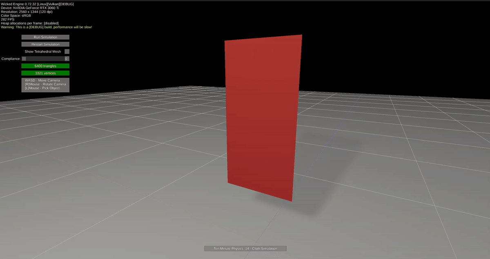

# Cloth Simulation Sample

Implementation of lesson [14 - Cloth Simulation](https://github.com/matthias-research/pages/blob/master/tenMinutePhysics/14-cloth.html) from the [Ten Minute Physics](https://matthias-research.github.io/pages/tenMinutePhysics/) series by [Matthias Müller](https://github.com/matthias-research).

**Created by:** [PAMinerva](https://github.com/PAMinerva) 
**Credits to:** [Matthias Müller](https://github.com/matthias-research) for the original concept and implementation. 
**Powered by:** [Wicked Engine](https://github.com/turanszkij/WickedEngine) 
Special thanks to [Turánszki János](https://github.com/turanszkij) for creating Wicked Engine and making it available under the MIT license.

## Overview

This project demonstrates real-time cloth simulation using triangular meshes with stretching and bending constraints, implemented with the Wicked Engine C++ API. 
The simulation is fully CPU-based and does not rely on external physics libraries such as Bullet, PhysX, or Havok.

## Key Features

- **Cloth Physics** - Simulates deformable cloth using position-based dynamics (PBD/XPBD) on a triangular mesh with stretching and bending constraints (which are both distance constraints essentially)
- **Dual Mesh Rendering** - Separate wireframe mesh and visual mesh representations, toggleable at runtime
- **Interactive Grabbing** - Vertices can be grabbed and moved with the mouse in real time
- **Wicked Engine Integration** - Full rendering, GUI, and camera controls via Wicked Engine

## Performance Notes

⚠️ **This implementation is suitable for educational purposes and moderate mesh sizes.**
- All simulation is performed on the CPU.
- No GPU acceleration or parallelization is used.
- Performance may degrade with very high-resolution meshes.

**Recommended use:** Educational purposes and small to medium-scale cloth simulations.

## How It Works

The simulation loop follows this pattern:

1. **PreSolve (Integrate)** - Update positions and velocities of mesh vertices with gravity using explicit integration, and handle ground collisions
2. **Solve (Constraint Projection)** - Enforce stretching (edge distance) and bending (opposite-vertex distance) constraints using PBD/XPBD
3. **PostSolve** - Compute new velocities from corrected positions
4. **Visualization** - Update mesh data (positions, normals, AABB) and upload to GPU for rendering

Each frame is processed in real time. Fixed vertices (top-left and top-right corners) keep the cloth hanging.

## Controls

- **WASD / Arrow Keys** - Move camera
- **Right Mouse / Middle Mouse** - Rotate camera
- **Left Mouse** - Pick and drag a vertex
- **GUI Buttons** - Run/Stop simulation, Restart, Show/Hide Wireframe Mesh, Adjust Bending Compliance

