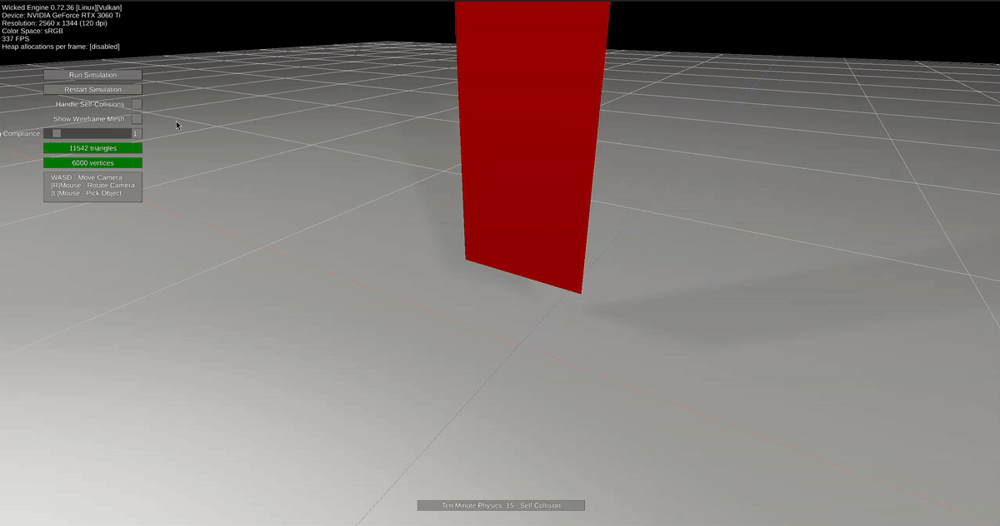

# Cloth Simulation Sample

Implementation of lesson [15 - Self Collision](https://github.com/matthias-research/pages/blob/master/tenMinutePhysics/15-selfCollision.html) from the [Ten Minute Physics](https://matthias-research.github.io/pages/tenMinutePhysics/) series by [Matthias Müller](https://github.com/matthias-research).

**Created by:** [PAMinerva](https://github.com/PAMinerva) 
**Credits to:** [Matthias Müller](https://github.com/matthias-research) for the original concept and implementation. 
**Powered by:** [Wicked Engine](https://github.com/turanszkij/WickedEngine) 
Special thanks to [Turánszki János](https://github.com/turanszkij) for creating Wicked Engine and making it available under the MIT license.

## Overview

This project demonstrates real-time cloth simulation with **self-collision detection** using triangular meshes, stretching/bending constraints, and **spatial hashing** for efficient collision queries, implemented with the Wicked Engine C++ API. 
The simulation is fully CPU-based and does not rely on external physics libraries such as Bullet, PhysX, or Havok.

## Key Features

- **Cloth Physics** - Simulates deformable cloth using position-based dynamics (PBD/XPBD) on a triangular mesh with stretching, shearing, and bending constraints (which are all distance constraints essentially)
- **Self-Collision Detection** - Particles detect and resolve collisions with each other using spatial hashing for efficient neighbor queries
- **Spatial Hashing** - Fast collision detection using a hash grid structure that organizes particles into spatial cells
- **Dual Mesh Rendering** - Separate front face (red), back face (yellow-ish), and wireframe mesh representations, toggleable at runtime
- **Interactive Grabbing** - Vertices can be grabbed and moved with the mouse in real time
- **Wicked Engine Integration** - Full rendering, GUI, and camera controls via Wicked Engine

## Performance Notes

⚠️ **This implementation is suitable for educational purposes and moderate mesh sizes.**
- All simulation is performed on the CPU.
- No GPU acceleration or parallelization is used.
- Performance may degrade with very high-resolution meshes.

**Recommended use:** Educational purposes and small to medium-scale cloth simulations.

## How It Works

The simulation loop follows this pattern:

1. **Integrate** - Update positions and velocities of particles with gravity using explicit integration, with velocity clamping to prevent tunneling
2. **Build Spatial Hash** - Organize particles into a spatial grid structure for efficient collision queries (once per frame)
3. **Query Neighbors** - Find all nearby particle pairs within collision distance using the spatial hash
4. **Solve Constraints** - Enforce stretching, shearing, and bending constraints using PBD/XPBD distance constraints
5. **Solve Ground Collisions** - Prevent particles from penetrating the ground plane
6. **Solve Self-Collisions** - Resolve particle-particle collisions using distance constraints with minimum separation (thickness)
7. **Update Velocities** - Compute new velocities from position corrections
8. **Visualization** - Update mesh data (positions, normals) and upload to GPU for rendering

Each frame is subdivided into multiple substeps for stability. The cloth falls freely without fixed attachment points.

## Controls

- **WASD / Arrow Keys** - Move camera
- **Right Mouse / Middle Mouse** - Rotate camera
- **Left Mouse** - Pick and drag a vertex
- **GUI Controls**:
  - **Run/Stop** - Start or pause the simulation
  - **Restart** - Reset the simulation to initial state
  - **Handle Self-Collisions** - Toggle particle-particle collision detection on/off
  - **Show Wireframe Mesh** - Toggle between solid shaded view and wireframe view
  - **Compliance Slider** - Adjust bending stiffness (lower = stiffer, higher = more flexible)

