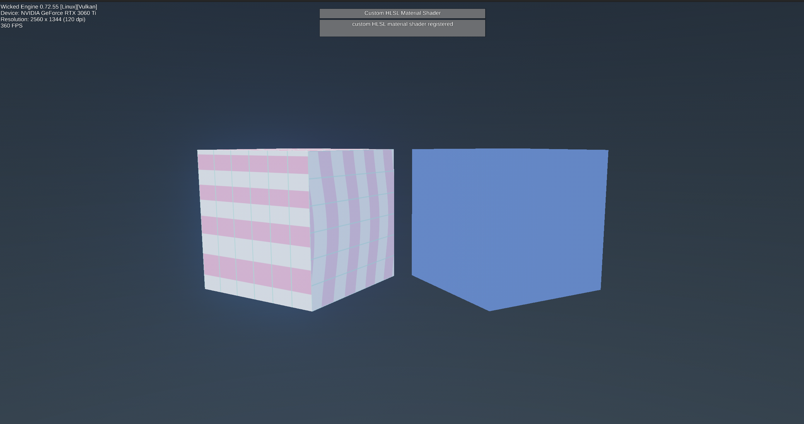

# Custom HLSL Material Shader



This sample demonstrates the smallest useful loop for attaching a custom HLSL pixel shader to a Wicked Engine material without modifying engine source code. The shader is loaded at runtime, compiled, and registered with the renderer.

It creates two cubes:

- the left cube uses `MaterialComponent::SetCustomShaderID()`
- the right cube uses a regular Wicked material for comparison

## What The Sample Does

1. Loads `shaders/custom_materialPS.hlsl` at runtime with `wi::renderer::LoadShader()`.
2. Builds a full `wi::graphics::PipelineState` for the material render pass.
3. Registers that PSO bundle with `wi::renderer::RegisterCustomShader()`.
4. Stores the returned ID on the cube material with `MaterialComponent::SetCustomShaderID()`.
5. Updates `MaterialComponent::userdata` every frame so the shader has editable material parameters.

This is the important distinction: the shader is not added to `wiEnums.h`, and the engine source is not modified.

## Files

```text
02-CustomMaterialShader/
├── CMakeLists.txt
├── sample.cpp / sample.h
├── main_SDL2.cpp
├── main_Windows.cpp
└── shaders/
    └── custom_materialPS.hlsl
```

## Key Code

- `RegisterCustomMaterialShader()` in `sample.cpp` loads the HLSL file and creates the custom PSO.
- `material->SetCustomShaderID(customShaderID)` attaches the registered shader to the material.
- `material->userdata` passes simple parameters to the HLSL shader.

The HLSL file includes Wicked's object shader helper:

```hlsl
#define OBJECTSHADER_LAYOUT_COMMON
#include "../../../../../WickedEngine/shaders/objectHF.hlsli"
```

That gives the custom pixel shader the same `PixelInput`, material buffer access, camera data, and object push constants used by Wicked's normal object shaders.

## Walkthrough

### 1. Compile An External HLSL File

`sample.cpp` temporarily points Wicked's shader compiler at this sample's `shaders/` directory:

```cpp
SetShaderSourcePath(SHADER_SOURCE_DIR);
LoadShader(ShaderStage::PS, customPixelShader, "custom_materialPS.cso");
```

The requested binary is named `custom_materialPS.cso`, but Wicked resolves it back to `custom_materialPS.hlsl` when no compiled shader exists yet. The compiled binary is written next to the sample executable, so editing the HLSL file does not require modifying or rebuilding engine source.

### 2. Build The Material Pipeline States

`RegisterCustomShader()` does not only take a pixel shader. It needs the pipeline states that Wicked will use when drawing objects with this material:

- `RENDERPASS_PREPASS`: regular object depth prepass
- `RENDERPASS_MAIN`: regular object vertex shader plus this sample's custom pixel shader
- `RENDERPASS_SHADOW`: regular shadow pass

The sample keeps the prepass and shadow pass on Wicked's built-in object shaders, then swaps only the main pass pixel shader.

### 3. Register The Shader Bundle

The configured `wi::renderer::CustomShader` is registered once the renderer has finished creating its built-in pipelines:

```cpp
customShaderID = RegisterCustomShader(customShader);
```

The returned ID is stored by Wicked and can be assigned to any material in code.

### 4. Attach It To A Material

The left cube material receives the returned custom shader ID:

```cpp
material->SetCustomShaderID(customShaderID);
material->SetDirty();
```

No new enum is added to `wiEnums.h`, no new slot is added to `wiRenderer.cpp`, and no editor integration is required for this path.

### 5. Pass Per-Material Parameters

The sample packs three floats into `MaterialComponent::userdata`:

- stripe count
- warp amount
- scroll speed

The HLSL side reads them with `asfloat(material.userdata.x/y/z)`. This is enough for scalar controls. For textures, transforms, or larger parameter blocks, the next step would be binding a custom resource through the PSO/resource binding path instead of using `userdata`.

## Adapting This Sample

To make a different material shader:

1. Copy `shaders/custom_materialPS.hlsl`.
2. Keep `#define OBJECTSHADER_LAYOUT_COMMON` and the `objectHF.hlsli` include if you want Wicked's normal object material inputs.
3. Change the pixel shader body.
4. If the shader needs only material constants, pack them through `MaterialComponent::userdata`.
5. If the shader changes render state, update the `PipelineStateDesc` in `RegisterCustomMaterialShader()`.

For an editor feature, this sample is not enough by itself: it proves the runtime mechanism, but an editor implementation would still need UI, serialization, shader path storage, hot reload behavior, and validation.

## Build

From the repository root:

```sh
cmake --build build --target 02-CustomMaterialShader --parallel
```

If using a different build directory, replace `build` with that directory.

## Editing The Shader

Edit:

```text
Samples/My_Samples/Rendering/02-CustomMaterialShader/shaders/custom_materialPS.hlsl
```

On SDL builds, focusing the window again triggers the existing shader-outdated check and `wi::renderer::ReloadShaders()`. This sample re-registers the custom material shader after a reload because Wicked clears user custom shader registrations during renderer reload.
